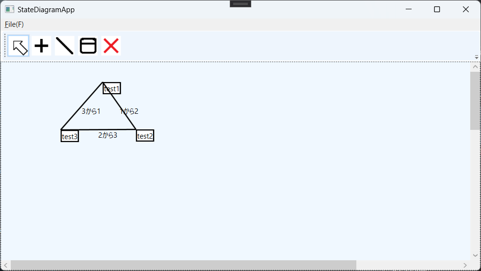

# StateDiagramApp

単純なダイアグラムを作ってXMLファイルで保存するツール(WPF)

おおもとのChatGPT3.5からのソースではバインディングに統一感がなく動かなかったので路線変更した。
完全な想像だが、UWPあたりなら通用する記述なのかもしれない。

大分前のChatGPT3.5なので今のやつならうまくやってくれるかも？

現状ツールとしては未完成すぎるのでソースコードを参考程度に使ってください。

# 必要package 

Microsoft.Xaml.Behaviors.Wpf

# ToDo

やることを覚えていられないのでメモをここに残す。

PropertyWindowでPointの編集がうまく動いていない。
XとYそれぞれにTextBoxを紐づければよいのだろうが…

~~StateTransitionを編集できるところをまだ作っていない。~~

~~削除系がまだできていない。~~

ラインを削除はできるが表示が残る

~~ノードを新規作成するときに座標がずれてしまう。~~

名前の統一がなされていない。

~~ファイル読み込み保存のテストはできた。~~

閉じるときに保存するか聞く機能がない

作成時と読み込み時で表示され方が変わってしまう（コントロールしていない）

